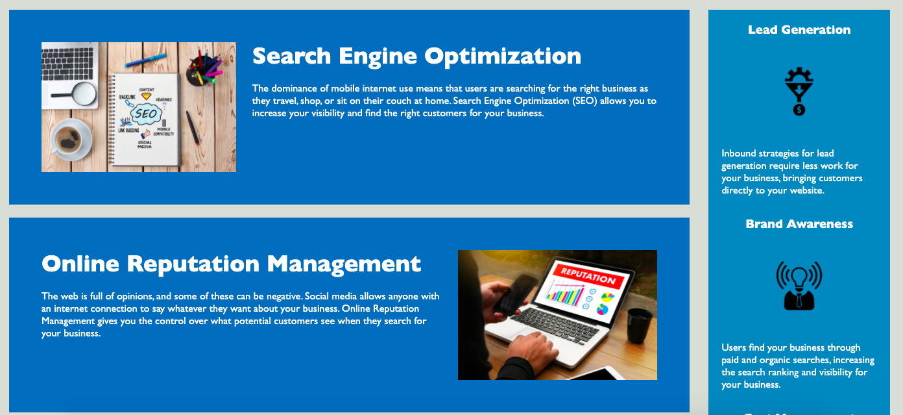

# Accessibility Practice

<!--  -->
<!--  -->
<!-- can put technologies here as shield icons and their versions -->

## Description 

Unaware of the world of accessibility, I stumbled upon a tweet from a blind individual who was having trouble accessing menu's on her 
UberEats account. The realization hit me then that so much of how we design our spaces and applications is based on the assuption of being 
"able-bodied". 

This is an excercise in accessibility in order to get an understanding of how I can better serve the non able-bodied community (or those with different internet accesses) better with my future applciations.
I've simply looked through a list of W3 school exmaples in order to adapt an already provided static html page to be more accessible. I've added alterantive tags to images in case a user for some reason can't view the images. I've additionally added a decriptive title and removed non-semantic elements such as . 

## Table of Contents

* [Description](#Description)
* [Technologies](#technologies)
* [Application](#Application)
* [Acknowledgements](#acknowledgements)
* [Questions](#questions)

## Technologies

* HTML
* CSS

## Application 

## Acknowledgements

* UW Coding Bootcamp instructional team and classmates
    * skeleton of html files already provided
* W3 Schools 

## Questions 

If you have any questions, please contact me on:
GitHub at [avaarm](https://github.com/avaarm)
Email at [Emma](mailto:avaarm95@mail.com)
